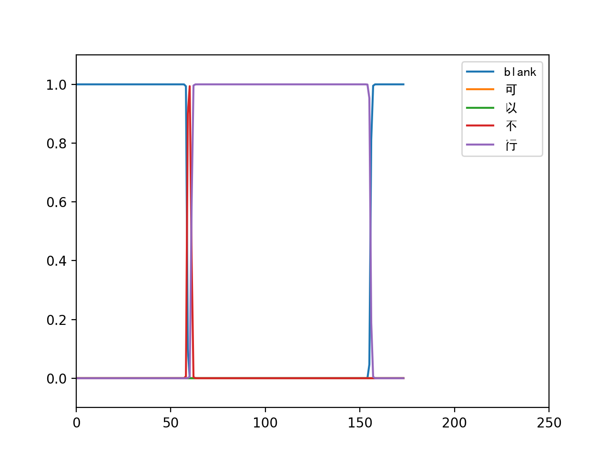
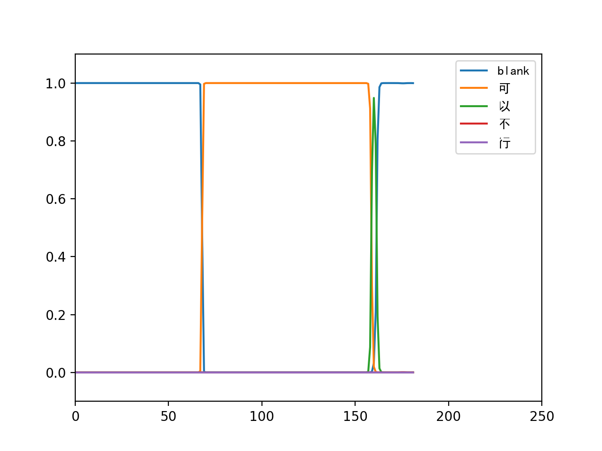

# Description

This a toy project that use Bi-directional RNN to recognize chinese speech. The corpus is very limited that only chinese yes(可以) and no(不行) in it. Since chinese words are monosyllabic, and we treat each word a phone, we only have to recognize five words which are '可', '以', '不', '行' and a special 'blank' (the pause between characters). 

The following graphs show the model output. In the first case, the speaker says '不行'. It can be seen that the '行' response follows the ''不' response. In the second case, the speaker says '可以', simillar response can be observed. The length of the response for different words are correlated with chinese pronunciation.

# Requirement

1. Chainer
2. python speech feature (https://github.com/jameslyons/python_speech_features)

